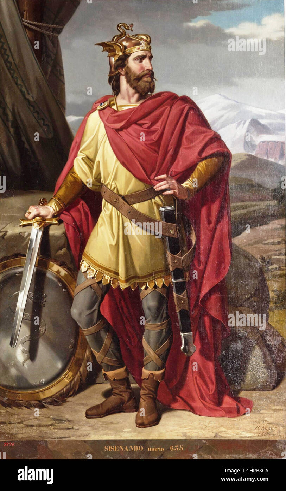

# Visigodos

Los visigodos fueron diversos pueblos bárbaros que, aprovechando la falta de oposición, se adentraron en Hispania. Este fenómeno coincide con el declive del Imperio Romano. Se firmó un tratado que permitía a los visigodos asentarse en el sur de la Galia y controlar ciertas regiones de Hispania.

## Índice

1. [ÉPOCA](ÉPOCA.md)
2. [Arquitectura]
3. [Obras más significativas](OBRAS.md)

## Referencia
[National Geographic](https://www.nationalgeographic.com.es/)

